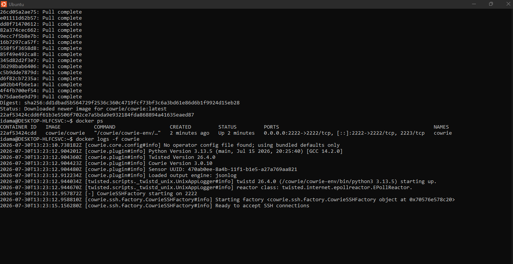
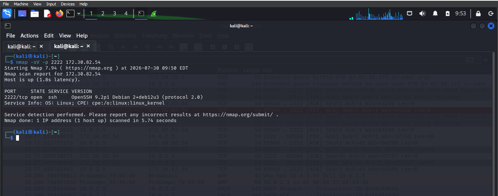
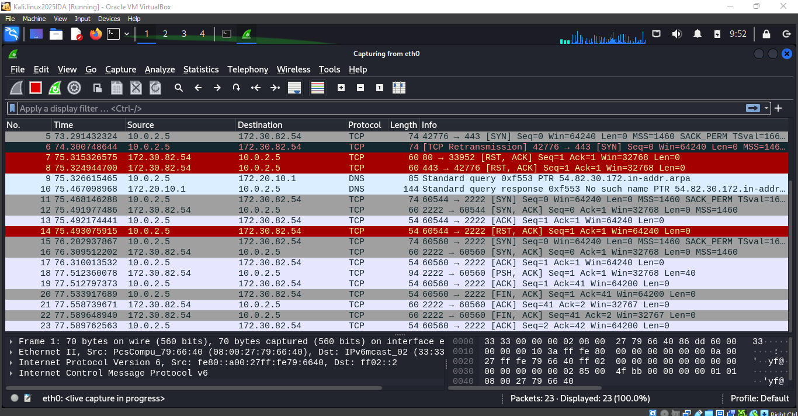

# Network Attack Detection & Honeypot Monitoring

## Project Overview

In this lab, I created an isolated cybersecurity environment
to simulate network reconnaissance and investigate the resulting
network activity.

I used Cowrie as an SSH honeypot, Nmap to perform authorized
network reconnaissance, and Wireshark to capture and analyze
the generated traffic.

## Tools Used

- Kali Linux
- Nmap
- Cowrie Honeypot
- Wireshark
- Docker

## Lab Workflow

Nmap Scanner → Cowrie SSH Honeypot → Network Traffic Capture → Analysis

## 1. Cowrie Honeypot Deployment

I deployed Cowrie Honeypot in an isolated lab environment
and configured it to emulate an SSH service.

<h3 align="center">This screenshot shows the Cowrie Honeypot running successfully in the cybersecurity lab environment
</h3>

    

## 2. Network Reconnaissance

I performed an authorized Nmap service scan against the
honeypot.

Command:

nmap -sV -p 2222 172.30.82.54

<h3 align="center">This screenshot shows the Nmap scan results obtained during the authorized network reconnaissance activity.</h3>

    

## 3. Network Traffic Analysis

I captured the generated network traffic using Wireshark.

The traffic showed TCP communication between the scanning
system and the Cowrie honeypot, including the TCP handshake
and SSH service interaction.

<h3 align="center">This screenshot shows the network packets captured during the interaction with the Cowrie Honeypot.
</h3>

    

## 4. Incident Analysis

The activity represented network reconnaissance against
an SSH service.

Impact: Low / Controlled

No production systems were affected because the activity
occurred inside an isolated cybersecurity lab.

## Security Recommendations

- Keep honeypots segmented from production networks.
- Restrict administrative SSH access.
- Use firewall rules and IP allow listing where appropriate.
- Monitor repeated connection attempts.
- Consider automated blocking controls such as Fail2ban.

## Key Takeaways

This project gave me hands-on experience with:

- Network reconnaissance
- Honeypot monitoring
- Packet analysis
- Security event investigation
- Incident documentation
